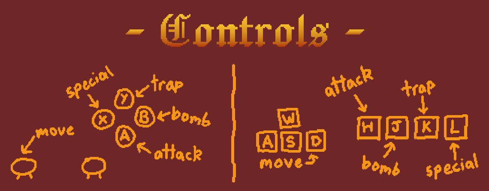
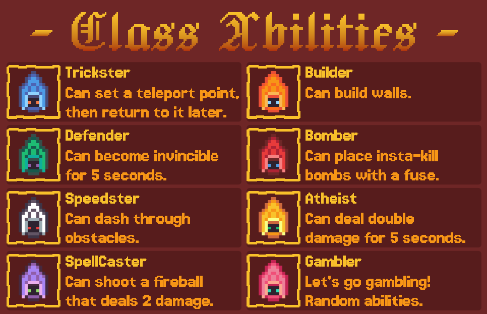
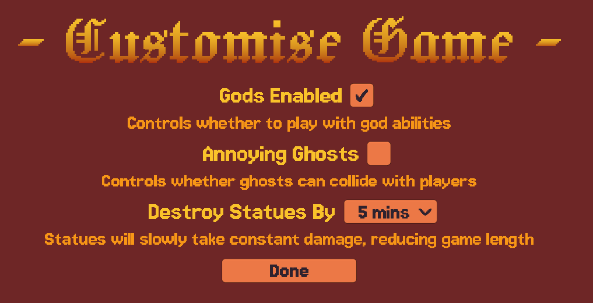
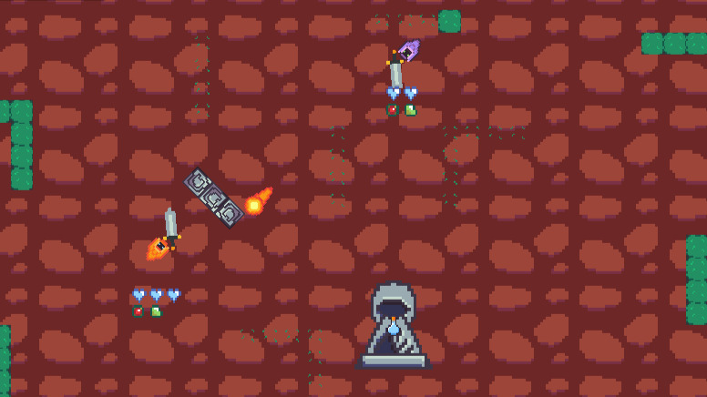
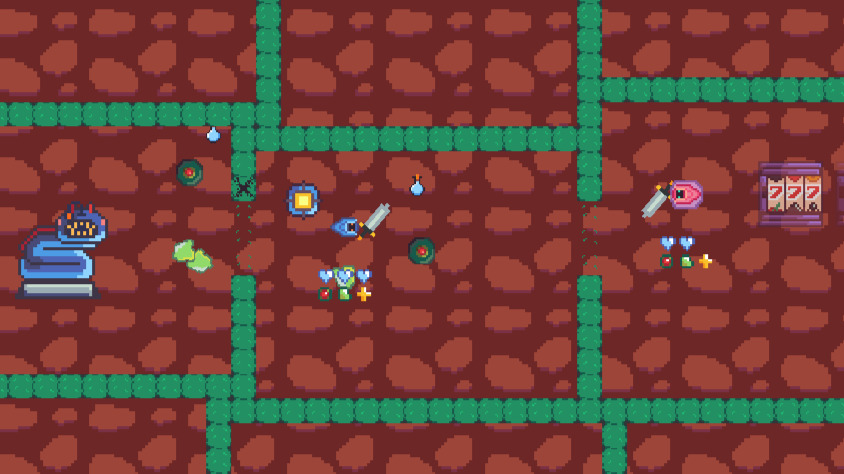
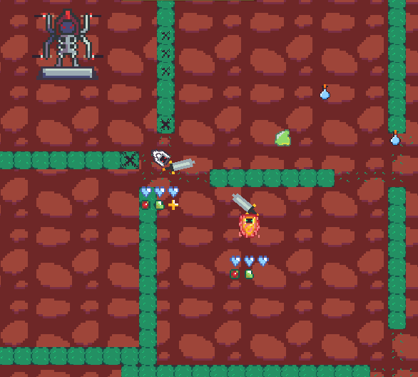
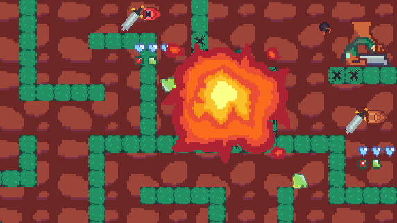
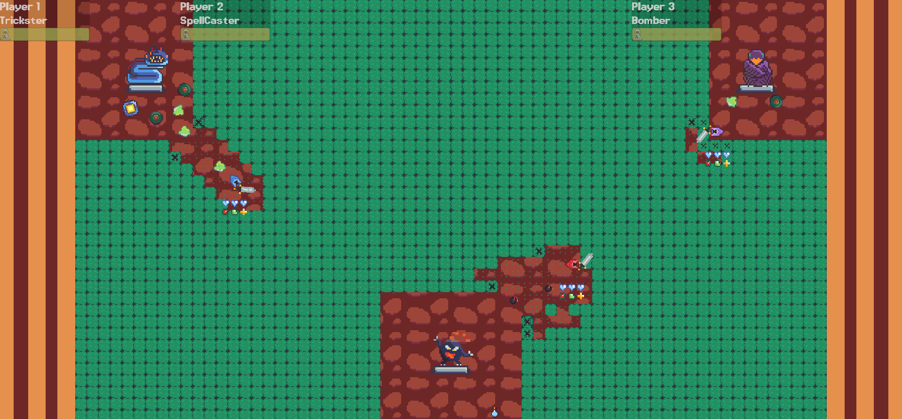

# Pantheon

Pantheon is a game about battling your friends with gods. 

- Each god has a statue that grants you the ability to respawn. 

- When is destroyed, you become mortal. 

- The last god to survive wins.

## Instructions

This game supports **2-8** players, and **at least one game controller is required**.

One player can play on keyboard, all others are required to use game controllers plugged into the same computer.

**Using Google Chrome is highly recommended!** Firefox and other browsers seem to have issues with game controllers.

### Controls

- Press "attack" in a lobby to change your class.

- Bombs deal 2 damage when stepped on. Traps freeze players for a short amount of time. Both bombs and traps will not be triggered by the player that placed them.

- "Special" is your class-specific ability - see below.

### Class Abilities

### Game Customisation

Various aspects of the game can be customised to your group's preferred playstyle.

## Screenshots

